# Diagram Skill — Mermaid 图表生成

本 skill 根据用户需求生成符合 Mermaid 10.x 语法标准的图表代码，嵌入 Markdown 文件的 ` ```mermaid ` 代码块中。

## 核心原则

1. **先理解需求** — 确认图表类型、数据内容、布局偏好
2. **输出 mermaid 代码块** — 放在 ` ```mermaid ` 和 ` ``` ` 之间
3. **语法正确优先** — 优先保证语法正确，其次才是美观
4. **中文内容直接用** — 节点/标签中的中文文本无需引号包裹
5. **添加 `accTitle` / `accDescr`** — 无障碍标题和描述，提升可访问性
6. **缩进一致** — 用 2 空格缩进，保持代码可读性

## 支持的图表类型

| 类型 | 关键字 | 主要用途 |
|------|--------|---------|
| 流程图 / Flowchart | `flowchart` / `graph` | 业务流程、决策树、系统逻辑 |
| 时序图 / Sequence | `sequenceDiagram` | API 调用、系统交互、用户操作流 |
| 甘特图 / Gantt | `gantt` | 项目进度、里程碑跟踪 |
| 思维导图 / Mindmap | `mindmap` | 头脑风暴、结构分层 |
| 架构图 / Architecture | `architecture-beta` | 系统架构、云服务拓扑 |
| 区块图 / Block | `block` | 布局示意图、列对齐 |
| 类图 / Class | `classDiagram` | 面向对象设计、UML 类关系 |
| ER 图 | `erDiagram` | 数据库表设计、实体关系 |
| 状态图 / State | `stateDiagram` | 状态机、生命周期 |
| 饼图 / Pie | `pie` | 占比展示、数据分布 |
| 时间线 / Timeline | `timeline` | 历史事件、阶段记录 |
| 用户旅程 / Journey | `journey` | 用户体验旅程 |
| 需求图 / Requirement | `requirementDiagram` | 需求追踪、追溯关系 |
| C4 Context | `C4Context` | C4 架构图（上下文） |
| C4 Container | `C4Container` | C4 架构图（容器） |
| C4 Component | `C4Component` | C4 架构图（组件） |
| C4 Dynamic | `C4Dynamic` | C4 架构图（动态） |
| C4 Deployment | `C4Deployment` | C4 架构图（部署） |
| 数据流图 / Dataflow | `flowchart` + `datastore` | 数据流向 |

---

## 1. 流程图 (flowchart)

### 基本语法

```
flowchart [LR|TD|BT|RL]
    节点形状 --> 节点形状
```

### 方向

- `LR` — 从左到右（默认）
- `TD` — 从上到下
- `BT` — 从下到上
- `RL` — 从右到左

### 节点形状

| 形状 | 语法 | 说明 |
|------|------|------|
| 默认 | `A` | 圆角矩形 |
| 圆形 | `((A))` | 双圆 |
| 圆形 | `(A)` | 圆 |
|  stadium | `([A])` | 药丸形 |
|  subroutine | `[[A]]` | 矩形（双线） |
|  cylinder | `[(A)]` | 圆柱（数据库） |
|  circle | `((A))` | 圆形 |
|  diamond | `{A}` | 菱形（决策） |
|  hexagon | `{{A}}` | 六边形 |
|  parallelogram | `/A/` | 平行四边形 |
|  trapezoid | `/A\` | 梯形 |
|  lean right | `A]` | 右斜矩形 |
|  lean left | `[A` | 左斜矩形 |

### 连接线

- `-->` 实线箭头
- `-.->` 虚线箭头
- `--o` 线 arrow
- `--x` 菱形 arrow
- `==>` 粗线
- `-.-` 虚线（无箭头）
- `--text--` 带标签箭头

### 子图分组

```
flowchart TB
    subgraph 外层
        A --> B
        subgraph 内层
            C --> D
        end
    end
```

### 样式

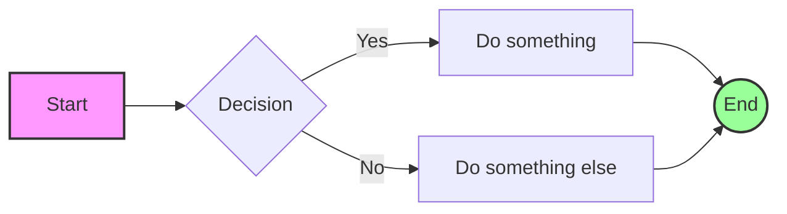

### 示例 — 审批流程

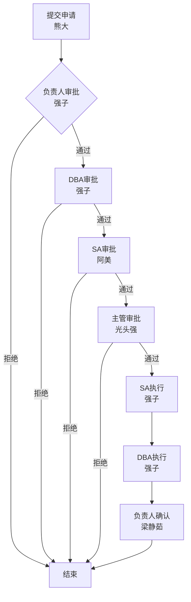

---

## 2. 时序图 (sequenceDiagram)

### 基本语法

```
sequenceDiagram
    participant 参与者 as 别名
    参与者 ->> 参与者: 消息
```

### 箭头类型

| 箭头 | 含义 |
|------|------|
| `->>` | 实线（同步） |
| `-->>` | 虚线（异步返回） |
| `-x` | 菱形箭头（消失） |
| `-)>` | 开放箭头（异步） |

### 激活/撤销

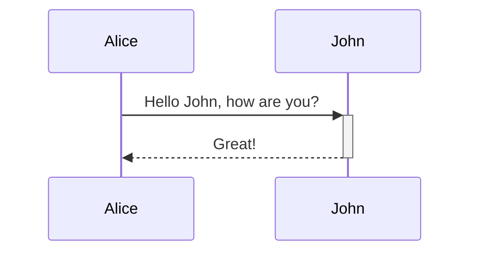

### 语法块

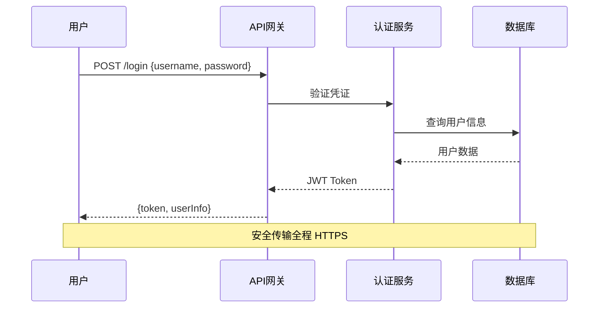

### 循环/可选块

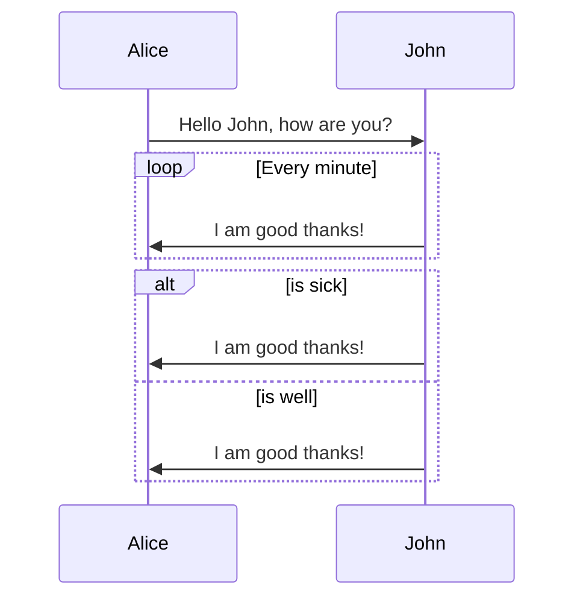

### 样式配置

```mermaid
%%{init: {"sequence": {"actorMargin": 80, "messageMargin": 40}}%%
```

---

## 3. 甘特图 (gantt)

### 基本语法

```
gantt
    title 标题
    dateFormat YYYY-MM-DD
    section 分组名
    任务名           :id, start, duration
    任务名           :crit, done, active, 任务标识, start, end
```

### 任务状态

| 标记 | 含义 |
|------|------|
| `done` | 已完成（深色） |
| `active` | 进行中 |
| `crit` | 关键路径（红色边框） |
| 默认 | 未开始 |

### 日期格式

- `YYYY-MM-DD` — 标准格式
- `YYYY-MM-DD HH:mm` — 精确时间
- `HH:mm:ss` — 当天时间

### 今日标记

```mermaid
gantt
    dateFormat YYYY-MM-DD
    title 项目甘特图
    todayMarker off
```

### 示例 — 项目进度

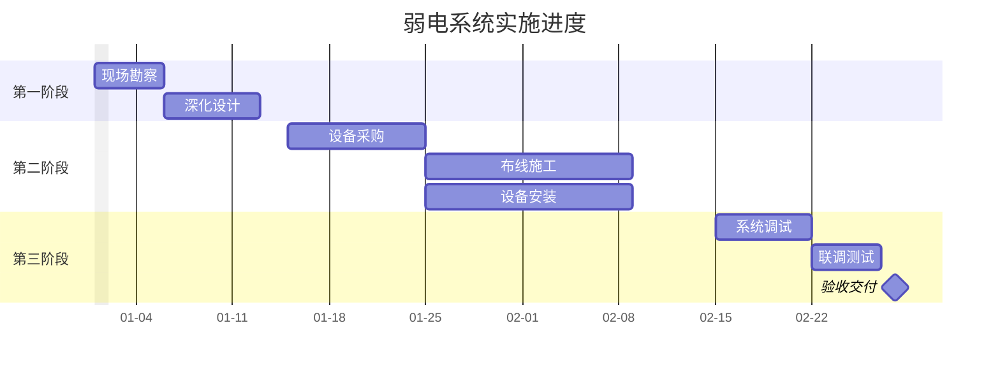

### 里程碑

```mermaid
    验收交付           :milestone, 2026-02-28, 0d
```

---

## 4. 思维导图 (mindmap)

### 基本语法

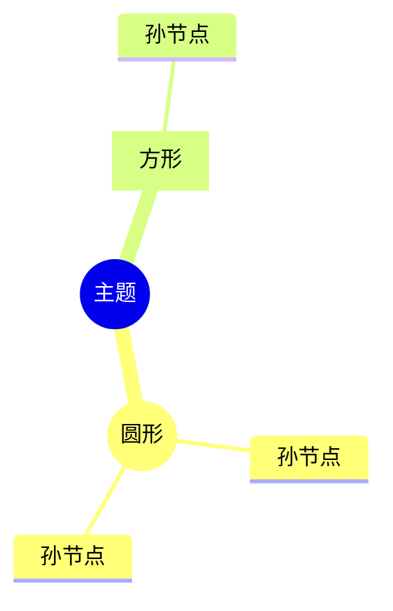

### 节点形状

| 形状 | 语法 |
|------|------|
| 默认 | `子主题` |
| 圆形 | `((子主题))` |
| 方形 | `[子主题]` |
| 圆角 | `(子主题)` |

### 三层结构原则

根据用户的 [[feedback_simple_mindmap]] 规则，项目 mindmap 只做三层：

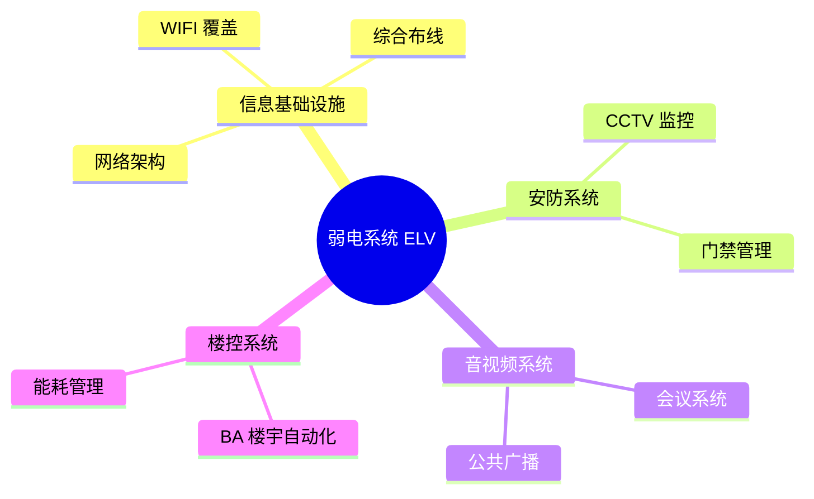

---

## 5. 架构图 (architecture-beta)

### 基本语法

```
architecture-beta
    group 组名(图标)[标签]
    service 服务名(图标)[标签] in 组名
    服务名:L -- R:服务名
```

### 图标支持

内置图标：`server`、`database`、`disk`、`cloud`、`internet`、`router`、`firewall`

外部图标（需注册）：
```javascript
mermaid.registerIconPacks([
  { name: 'logos', loader: () => fetch('https://unpkg.com/@iconify-json/logos/icons.json').then(r => r.json()) }
]);
```

### 连接方向

- `L` — 左
- `R` — 右
- `T` — 上
- `B` — 下

### 示例 — 云架构


---

## 6. 区块图 (block)

### 基本语法

```
block
columns 列数
  块A  块B  块C
  块D:2  块E 块F:2
```

### 跨列语法

```
  wide_block:2
```

### 示例 — 机柜布局

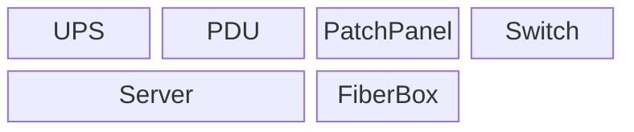

---

## 7. 类图 (classDiagram)

### 基本语法

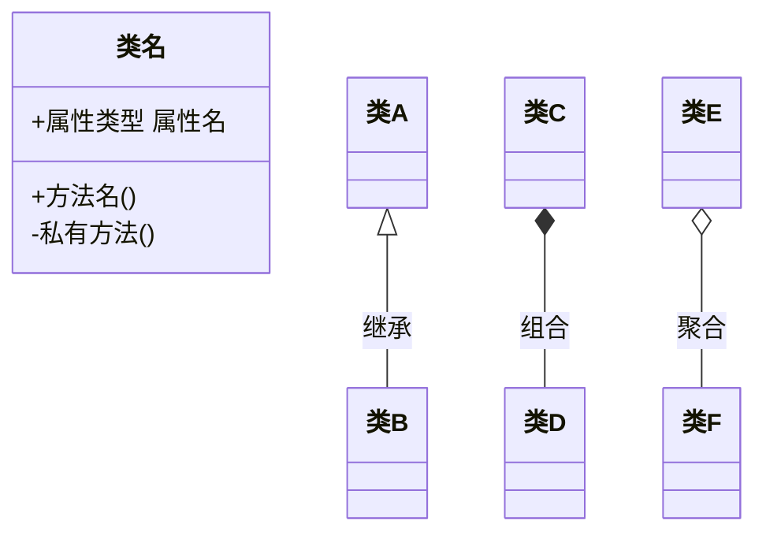

### 关系符号

| 符号 | 关系 |
|------|------|
| `<|--` | 继承 |
| `*--` | 组合 |
| `o--` | 聚合 |
| `-->` | 关联 |
| `..` | 依赖 |
| `..>` | 实现 |

### 可见性

| 符号 | 含义 |
|------|------|
| `+` | public |
| `#` | protected |
| `-` | private |
| `~` | package |

---

## 8. ER 图 (erDiagram)

### 基本语法

```mermaid
erDiagram
    ENTITY_A {
        int id PK
        string name
        int fk FK
    }
    ENTITY_B {
        string code UK
        int value
    }
    ENTITY_A ||--o{ ENTITY_B : "关系描述"
```

### 基数符号

| 符号 | 含义 |
|------|------|
| `||` | 有且仅有 |
| `{|` | 至少一个 |
| `o|` | 零或一个 |
| `o{` | 零或多个 |
| `}|` | 一个或多个 |
| `}|{` | 多对多 |

---

## 9. 状态图 (stateDiagram)

### 基本语法

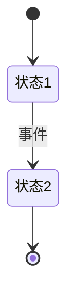

### 复合状态

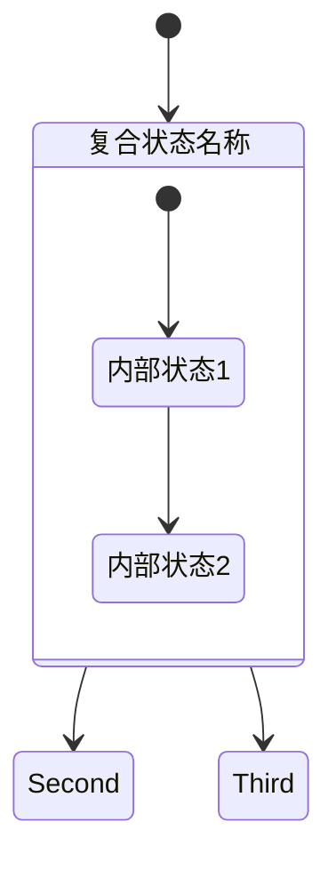

---

## 10. 饼图 (pie)

### 基本语法


### 示例

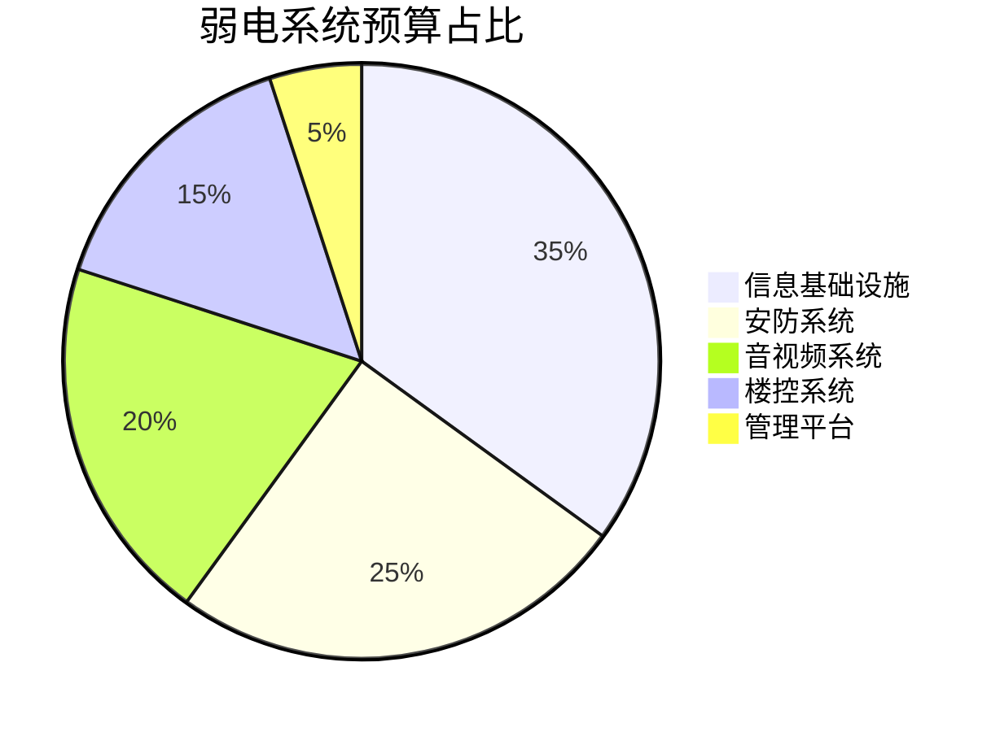

---

## 11. 时间线 (timeline)

### 基本语法

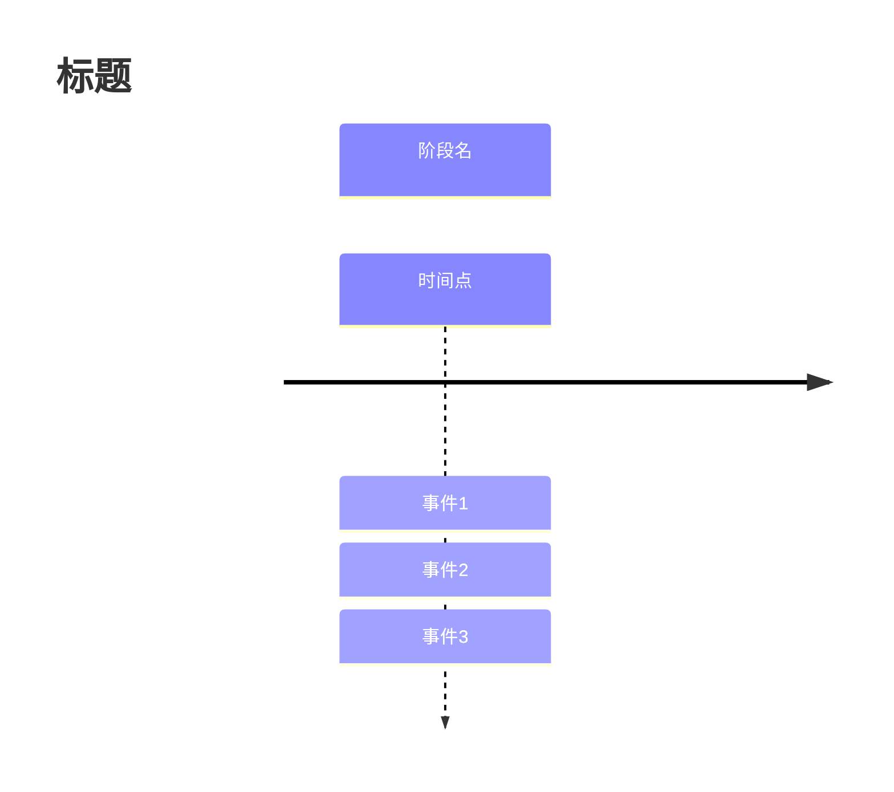

### 布局方向

- 默认 TD（从上到下）
- `timeline LR`（从左到右）

---

## 12. 用户旅程 (journey)

### 基本语法

```mermaid
journey
    title 标题
    section 阶段
        任务 : 分数 : 执行者
```

### 分数说明

1-5 分：1 = 不满意，5 = 非常满意

---

## 13. 需求图 (requirementDiagram)

### 基本语法

```mermaid
requirementDiagram
    requirement test_req {
        id: 1
        text: 需求描述
        risk: high
        verifymethod: test
    }
    functionalRequirement req2 {
        id: 1.1
        text: 功能需求
        risk: low
        verifymethod: inspection
    }
    element test_entity {
        type: simulation
    }
    test_entity - satisfies -> req2
```

---

## 14. C4 架构图

### C4Context 示例

```mermaid
C4Context
    accTitle: 系统上下文
    accDescr: 展示系统与外部参与者的关系

    title 系统上下文

    Person(customer, "用户", "使用系统的最终用户")
    System(sys, "弱电系统", "管理建筑弱电设施")

    System_Ext(external, "第三方系统", "提供数据交换")

    BiRel(customer, sys, "使用")
    Rel(sys, external, "数据同步")
```

---

## 15. 数据流图 (dataflow)

### 基本语法

使用 `flowchart` + 数据流专用形状：

```mermaid
flowchart LR
    accTitle: 数据流向
    accDescr: 展示数据从采集到存储的完整流程

    DataStore@{shape: datastore, label: "数据源"} -->|input| Process((处理)) -->|output| Entity[输出];
```

---

## 常用样式配置

### 全局主题设置

```mermaid
%%{init: {"theme": "forest", "themeVariables": {"fontSize": "16px"}}}%%
```

### 可用主题

- `base` — 默认中性
- `default` — 浅灰蓝
- `forest` — 森林绿
- `dark` — 深色
- `neutral` — 灰色调

### 流程图曲线

```mermaid
%%{init: {"flowchart": {"curve": "basis", "htmlLabels": true}}}%%
```

### 常用 CSS 变量（themeVariables）

| 变量 | 作用 |
|------|------|
| `fontSize` | 字体大小 |
| `primaryColor` | 主色 |
| `primaryTextColor` | 主文字色 |
| `primaryBorderColor` | 主边框色 |
| `lineColor` | 连接线颜色 |
| `secondaryColor` | 次要色 |
| `tertiaryColor` | 第三色 |

---

## 输出规范

生成图表时遵循：

1. **始终包含 `accTitle` 和 `accDescr`**（无障碍必需）
2. **图表标题用 `title`**（甘特图等支持）
3. **中文内容直接写在节点内**，无需引号
4. **线条标签用引号**：`A -->|"带中文标签"| B`
5. **避免超长节点文本**，长文本用 `\n` 换行
6. **甘特图日期用 `YYYY-MM-DD`**，进度条格式：`🔵 完成` / `🔴 未开始`
7. **思维导图最多三层**，不展开细节

---

## 常见错误排查

| 错误 | 原因 | 解决 |
|------|------|------|
| `Parse error` | 语法错误 | 检查括号配对、箭头语法 |
| 节点重叠 | `useMaxWidth: false` 未设 | 添加 `useMaxWidth: false` |
| 中文乱码 | 字体配置问题 | 在 Obsidian 预览中查看 |
| 子图中节点不可见 | 子图语法错误 | 检查 `end` 配对 |
| 时序图消息错位 | 参与者顺序问题 | 调整 participant 顺序 |