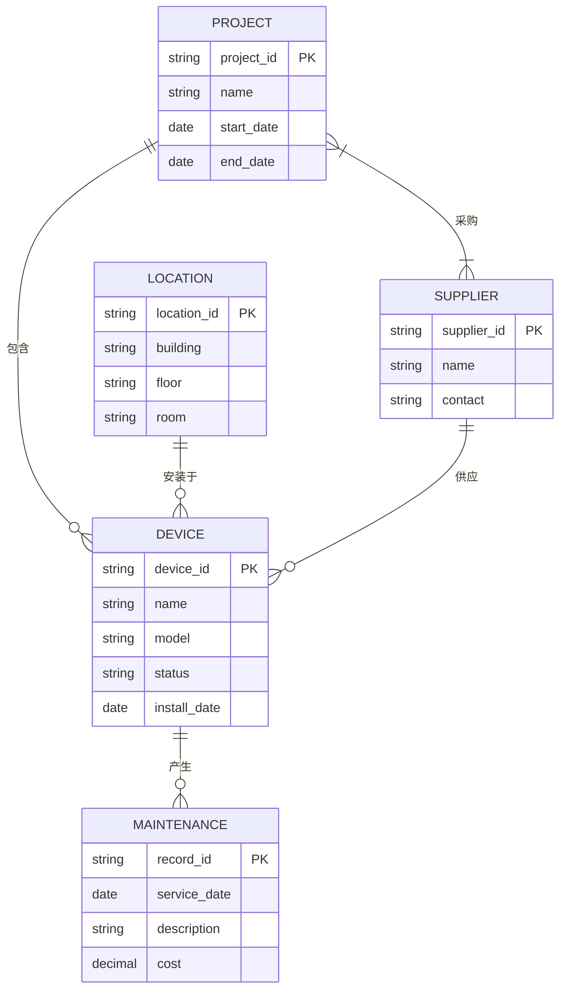

# ER 图（erDiagram）范本 — 弱电设备资产 ER

## 弱电设备资产管理 ER

场景：弱电项目交付后转入运维阶段，设备资产管理的核心实体和关系。5 个实体（项目 / 设备 / 位置 / 维保记录 / 供应商）+ 1:N / N:M 关系。适用于运维平台数据库设计或资产清单管理流程说明。

## 节点清单

### 实体

| 实体 | 含义 | 主键 |
|------|------|------|
| PROJECT | 项目 | project_id |
| DEVICE | 设备 | device_id |
| LOCATION | 位置（建筑/楼层/房间） | location_id |
| MAINTENANCE | 维保记录 | record_id |
| SUPPLIER | 供应商 | supplier_id |

### 关系

| 关系 | 类型 | 含义 |
|------|------|------|
| PROJECT 包含 DEVICE | 1:N | 一个项目有多台设备 |
| LOCATION 安装于 DEVICE | 1:N | 一个位置可装多台设备 |
| DEVICE 产生 MAINTENANCE | 1:N | 一台设备有多次维保 |
| SUPPLIER 供应 DEVICE | 1:N | 一个供应商供多台设备 |
| PROJECT 采购 SUPPLIER | N:M | 一个项目向多个供应商采购 |

## 关系符号说明

| 符号 | 含义 |
|------|------|
| `||` | 一（exactly one） |
| `o{` | 零或多（zero or many） |
| `}|` | 一或多（one or many） |
| `}o` | 零或一（zero or one） |

## 使用提示

- 实体属性用大括号 `{}` 包裹，每行 `type name [PK/FK]`
- 关系符号在左侧表示基数，右箭头方向不重要
- N:M 关系用 `}|--|{` 表示两侧都可有多个
- 总实体 ≤ 8 个，每个实体属性 ≤ 6 个，超出请拆子图
- 中文属性名直接用，无需引号
