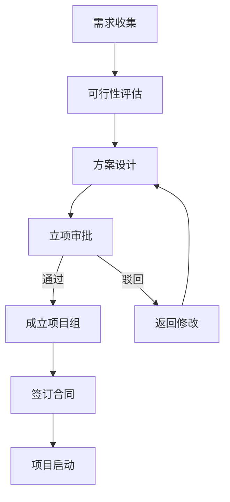

# 流程图（flowchart）范本 — 弱电项目立项流程

## 弱电项目立项流程

场景：弱电项目从需求收集到立项审批的完整流程，含审批通过/驳回分支。适用于方案工程师在项目初期向客户/领导展示项目推进步骤，也用于内部 SOP 文档。

## 节点清单

| 节点 ID | 中文标签 | 含义 |
|---------|---------|------|
| A | 需求收集 | 客户提需求，业务部门整理 |
| B | 可行性评估 | 技术/成本/工期三维评估 |
| C | 方案设计 | 弱电四大系统初步方案 |
| D | 立项审批 | 提交立项书，领导审批 |
| E | 成立项目组 | 通过后组建 PM + 工程师团队 |
| F | 返回修改 | 驳回后回 C 重新设计 |
| G | 签订合同 | 与客户/供应商签合同 |
| H | 项目启动 | 召开启动会，进入实施 |

## 使用提示

- 节点 ID 全大写字母，便于边标签引用
- 边标签用 `-->|标签|`，中文不需要引号
- 审批类分支（通过/驳回）画在主干上，便于一眼看清决策点
- 超过 15 节点建议拆分主流程 + 详情子图
