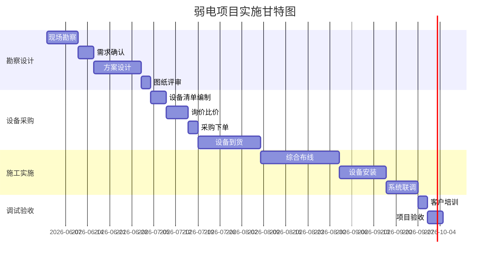

# 甘特图（gantt）范本 — 弱电项目实施甘特

## 弱电项目实施甘特

场景：弱电系统集成项目从勘察设计到调试验收的完整工期计划，4 个阶段 12 个子任务，跨度约 4 个月。适用于项目启动会和周报进度跟踪。

## 节点清单

| 任务 ID | 任务名 | 阶段 | 工期 |
|---------|--------|------|------|
| a1 | 现场勘察 | 勘察设计 | 10 天 |
| a2 | 需求确认 | 勘察设计 | 5 天 |
| a3 | 方案设计 | 勘察设计 | 15 天 |
| a4 | 图纸评审 | 勘察设计 | 3 天 |
| b1 | 设备清单编制 | 设备采购 | 5 天 |
| b2 | 询价比价 | 设备采购 | 7 天 |
| b3 | 采购下单 | 设备采购 | 3 天 |
| b4 | 设备到货 | 设备采购 | 20 天 |
| c1 | 综合布线 | 施工实施 | 25 天 |
| c2 | 设备安装 | 施工实施 | 15 天 |
| c3 | 系统联调 | 施工实施 | 10 天 |
| d1 | 客户培训 | 调试验收 | 3 天 |
| d2 | 项目验收 | 调试验收 | 5 天 |

## 使用提示

- **必须 `dateFormat YYYY-MM-DD`**（仓库规范，不用 M/D/YY）
- 用 `section` 分组任务段，类似甘特图的泳道
- 任务依赖用 `after <id>`，避免硬编码开始日期
- 单段任务不超过 6 个，4 段总任务 ≤ 25
- 工期超过 30 天的任务建议拆分子任务
