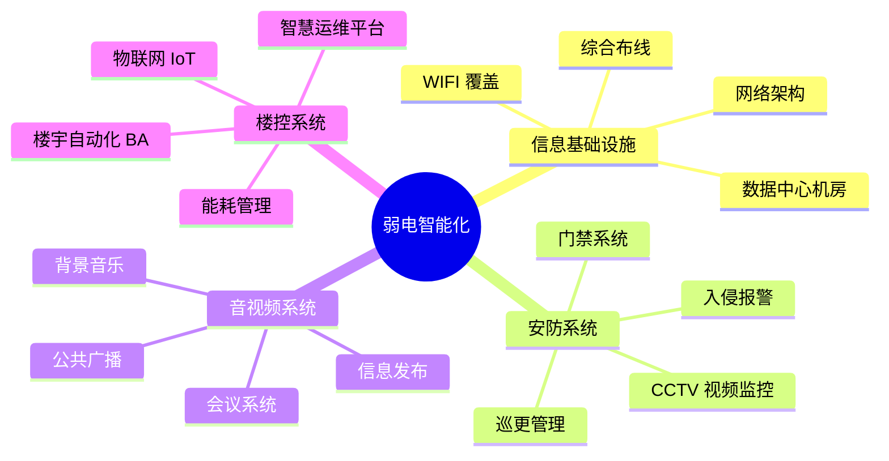

# 思维导图（mindmap）范本 — 弱电四大系统

## 弱电智能化四大系统

场景：弱电智能化设计的核心能力圈拆解，4 大主系统 + 12 个子系统。适用于项目方案首页的能力清单，也用于内部培训材料展示弱电工程师的工作范围。

## 节点清单

| 层级 | 节点 | 含义 |
|------|------|------|
| 根 | 弱电智能化 | 顶层主题 |
| L1 | 信息基础设施 | 网络/布线/机房 |
| L1 | 安防系统 | 视频/门禁/报警 |
| L1 | 音视频系统 | 会议/广播/信息发布 |
| L1 | 楼控系统 | BA/能耗/IoT |
| L2 | 综合布线 / 网络架构 / WIFI / 机房 | 信息基础设施子系统 |
| L2 | CCTV / 门禁 / 入侵报警 / 巡更 | 安防子系统 |
| L2 | 会议 / 广播 / 信息发布 / 背景音乐 | 音视频子系统 |
| L2 | BA / 能耗 / IoT / 运维平台 | 楼控子系统 |

## 使用提示

- 思维导图**最多 3 层**（根 + L1 + L2），不展开细节
- 根节点用 `((文本))` 表示粗圆圈
- 子节点用缩进表达层级，**统一 2 空格缩进**
- 每个 L1 分支保持 3-4 个子项，对称美观
- 总节点数 ≤ 25，超出请按子系统再画一张图
