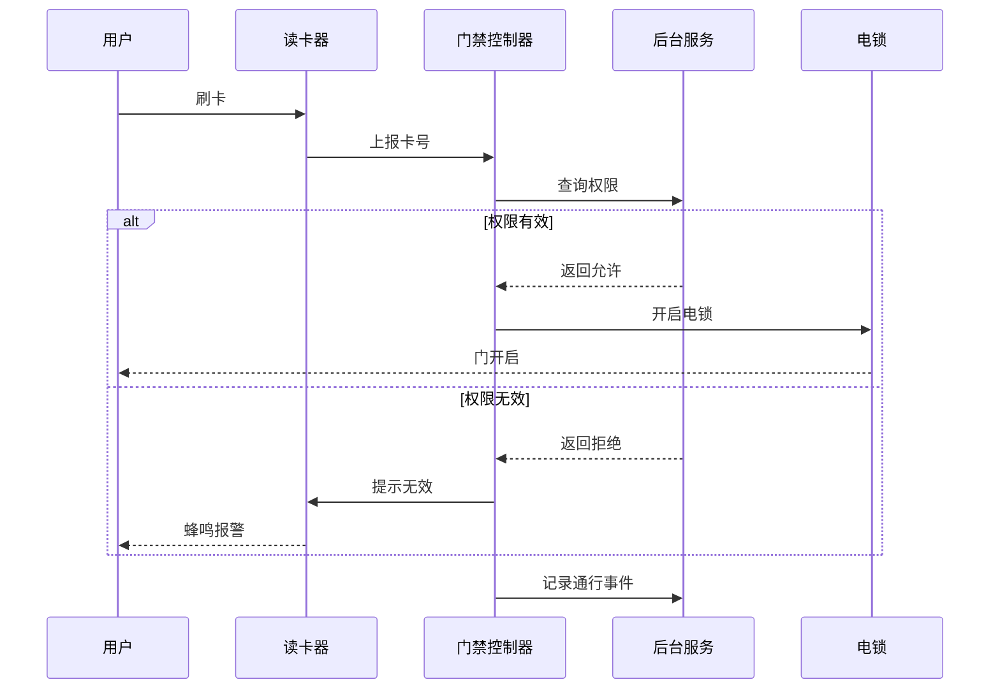

# 时序图（sequenceDiagram）范本 — 门禁刷卡认证时序

## 门禁刷卡认证时序

场景：用户持卡在门禁读卡器上刷卡，从读取卡号到电锁开启的完整认证时序，含正常流程和失败重试分支。适用于方案文档中说明门禁系统工作原理，或向客户演示刷卡流程。

## 节点清单

| 参与者 | 角色 | 含义 |
|--------|------|------|
| U | 用户 | 持卡人 |
| R | 读卡器 | 读取卡片 ID |
| C | 门禁控制器 | 接收读卡器数据，与后台通信，控制电锁 |
| S | 后台服务 | 权限数据库 + 通行记录 |
| L | 电锁 | 控制门开启/关闭的执行设备 |

## 消息清单

| 序号 | 消息 | 类型 | 含义 |
|------|------|------|------|
| 1 | 刷卡 | 实线箭头 → | 用户动作触发 |
| 2 | 上报卡号 | 实线箭头 → | 读卡器主动上报 |
| 3 | 查询权限 | 实线箭头 → | 控制器向后台查询 |
| 4 | 返回允许/拒绝 | 虚线箭头 ⇢ | 后台响应 |
| 5 | 开启电锁 | 实线箭头 → | 控制器执行 |
| 6 | 门开启 | 虚线箭头 ⇢ | 物理反馈 |
| 7 | 记录通行事件 | 实线箭头 → | 日志写入 |

## 使用提示

- 参与者按业务流程**从左到右**排序（用户/外部系统在前，内部服务在后）
- 正常流程用 `alt`，失败分支用 `else`
- 同步调用用 `->>`，异步/响应用 `-->>`（虚线）
- 长流程超过 10 条消息建议拆成多个时序图
