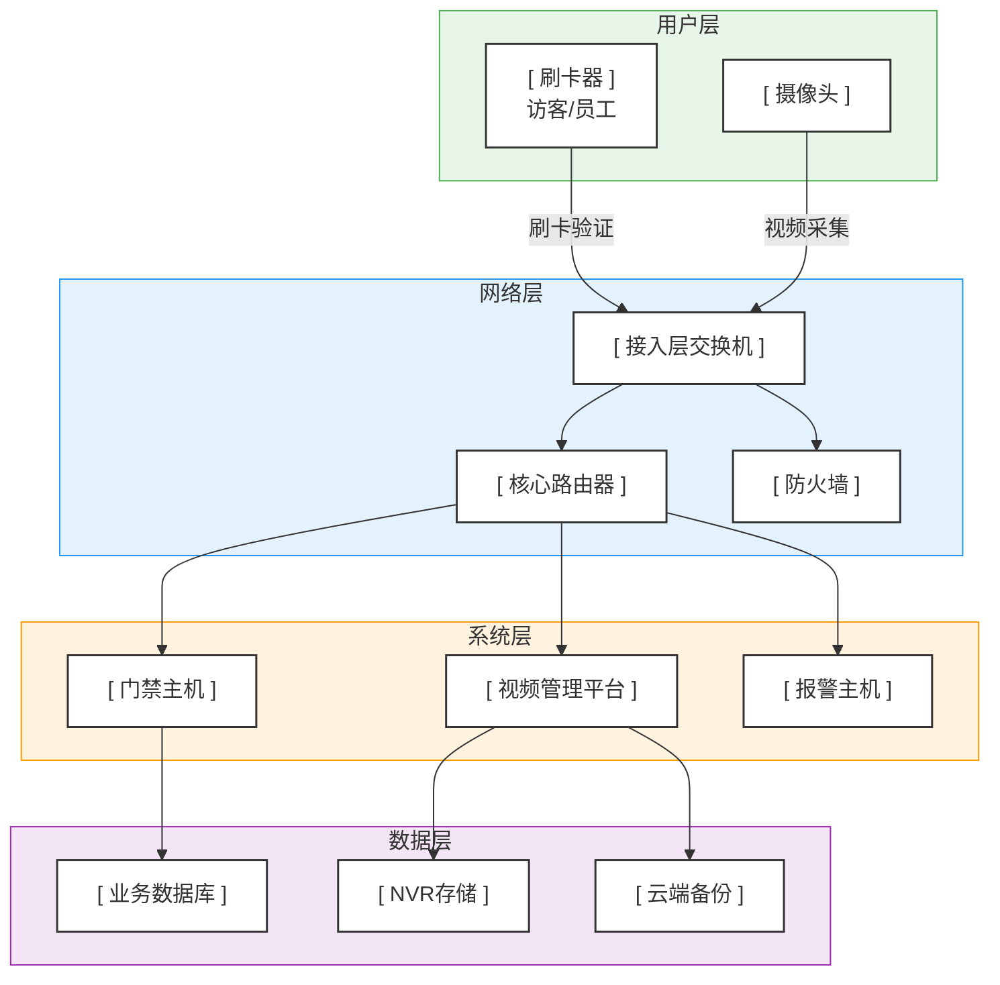
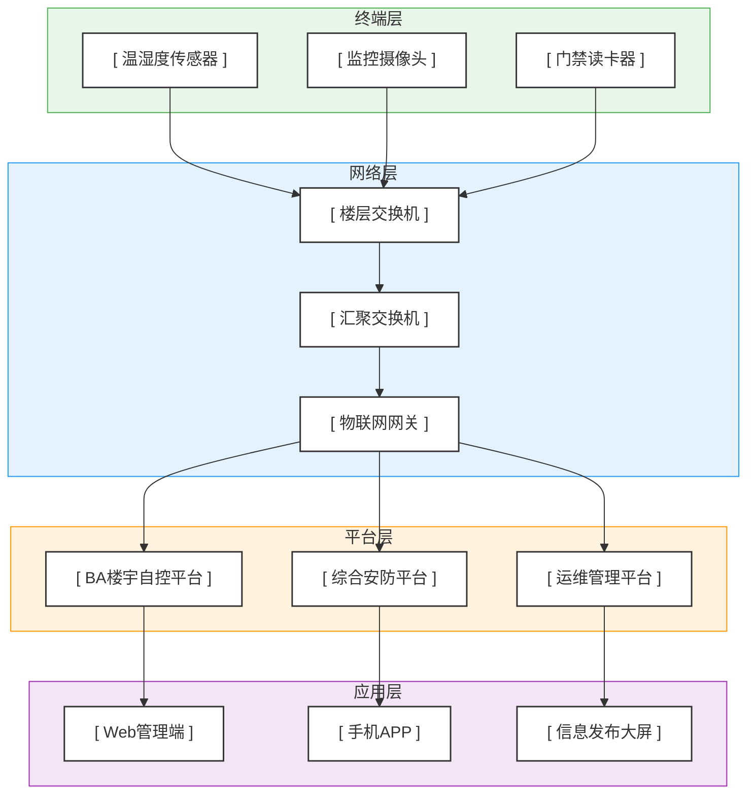
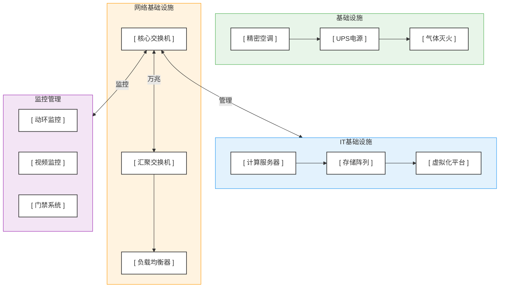
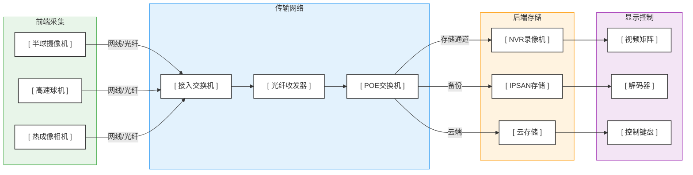
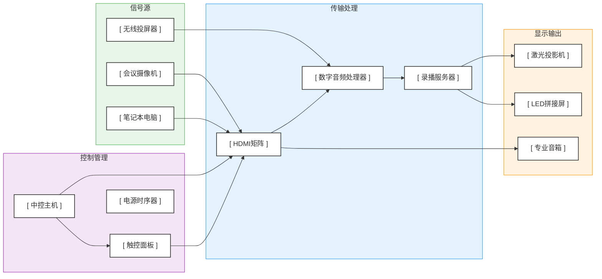
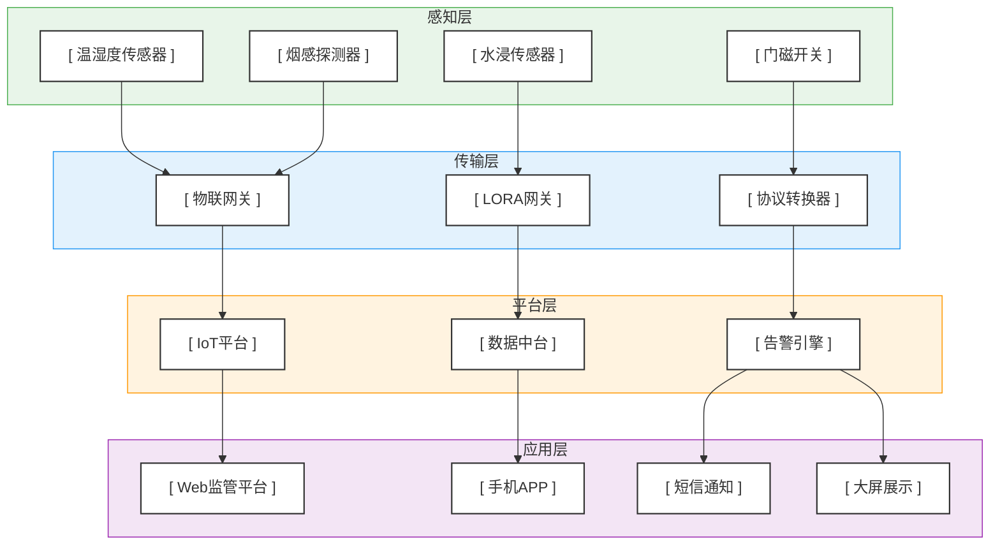

# ELV System Architecture Diagrams / 弱电系统架构图集

> 注：以下图表使用 `flowchart` 语法撰写，确保与 Mermaid 10.x（Obsidian 内置版本）完全兼容。

---

## 1. 弱电系统整体架构

弱电系统整体架构分为用户层、网络层、系统层和数据层，涵盖门禁、视频监控、报警等核心子系统。

---

## 2. 智慧楼宇系统架构

智慧楼宇系统架构分为终端层、网络层、平台层和应用层，整合楼控、安防、运维等多个子系统。

---

## 3. 数据中心机房架构

数据中心机房架构分为机房基础设施、IT基础设施、网络基础设施和监控管理四大模块，保障机房安全稳定运行。

---

## 4. 视频监控系统架构

视频监控系统架构分为前端采集、传输网络、后端存储和显示控制四个环节，实现从采集到显示的全链路管理。

---

## 5. 会议系统架构

会议系统架构分为信号源、传输处理、显示输出和控制管理四个部分，满足现代化会议音视频需求。

---

## 6. 弱电物联网架构

弱电物联网架构分为感知层、传输层、平台层和应用层，实现设备接入、数据处理与业务应用的端到端打通。

---

*编制人：DUDU&Cailleach*