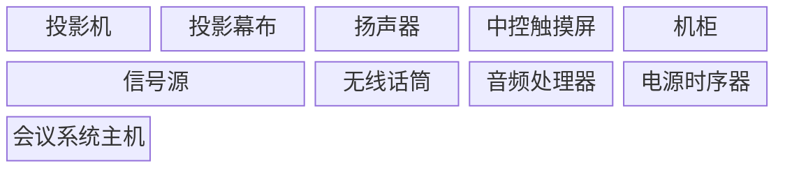
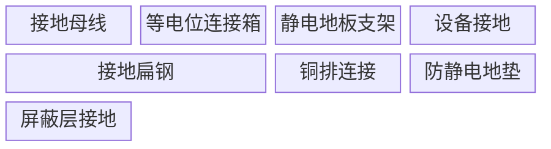
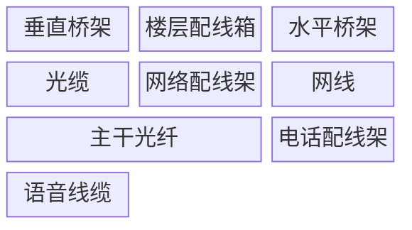

# 弱电系统 Block 布局图集

> ELV System Block Layout Diagrams — Mermaid 代码示例

---

## 1. 机柜设备布局

机柜内常见设备排列：UPS、PDU、配线架、交换机占据标准槽位，服务器占据 2 格宽度，磁盘阵列、光纤盒、防火墙填补剩余空间。

---

## 2. 监控中心设备布局

监控中心标准工位规划：操作台并排放置，电视墙承担显示职能，监视器占用 2 格宽度，工位与设备一一对应。

---

## 3. 会议室音视频布局

会议室 AV 系统核心设备排布：投影机与投影幕布协同工作，信号源占 2 格宽度，机柜集中放置功放、处理器等设备，中控触摸屏独立控制全系统。

---

## 4. 机房接地系统布局

机房接地系统等电位布局：接地母线作为主干，扁钢承担水平连接任务，等电位连接箱汇总各分支，设备与屏蔽层各自独立接地。

---

## 5. 弱电井道布局

弱电竖井垂直与水平布线规划：垂直桥架贯穿全高，光缆作为主干占 2 格宽度，水平桥架连接各楼层配线箱，形成完整的垂直水平布线体系。

