# 弱电项目流程图集 — ELV Flowchart Examples

本文件收录弱电（ELV）项目中常见的 14 个业务流程 Mermaid 流程图，涵盖项目立项至运维全生命周期。

---

## 1. 项目立项流程

项目立项流程用于判断需求是否具备实施条件，通过审批 diamond 分支决定是否成立项目组。

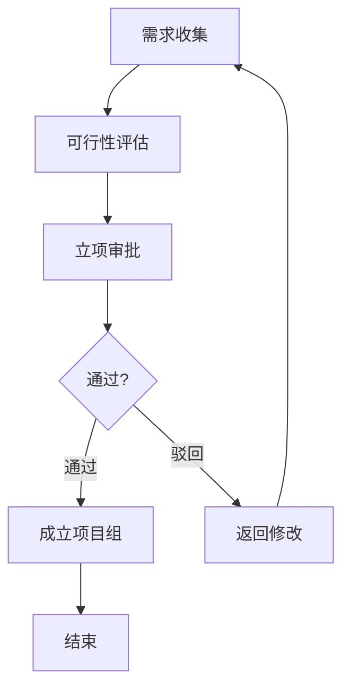

---

## 2. 现场勘察流程

现场勘察流程涵盖任务下达、踏勘、数据采集、报告编制及客户确认全流程。

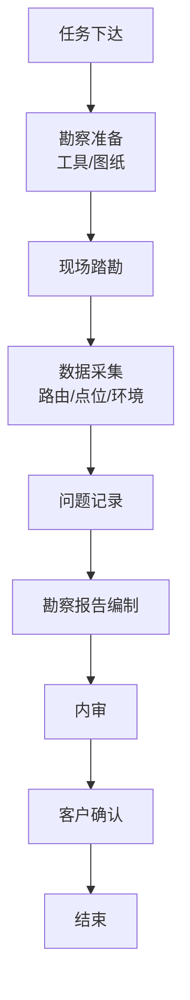

---

## 3. 需求调研流程

需求调研流程通过用户访谈收集并确认需求，以签字确认 diamond 分支决定归档或返回修改。

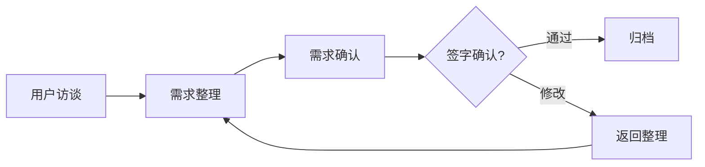

---

## 4. 方案设计流程

方案设计流程包含内部审核与客户评审双重 diamond 分支，确保方案质量。

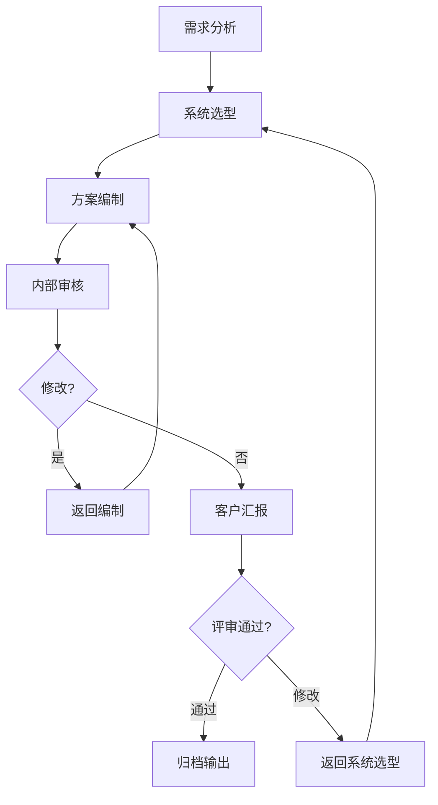

---

## 5. 深化设计流程

深化设计流程涵盖施工图深化、各专业会签及冲突检查，通过 diamond 分支决定归档或返修。

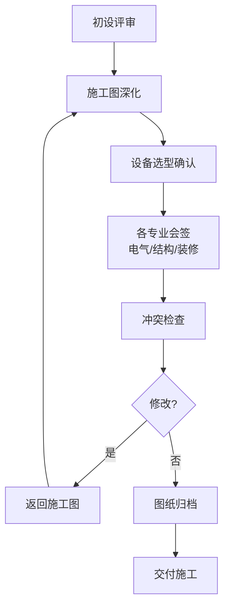

---

## 6. 设计变更流程

设计变更流程评估变更对范围、成本、工期的影响，以业主审批 diamond 分支决定实施或重新评估。

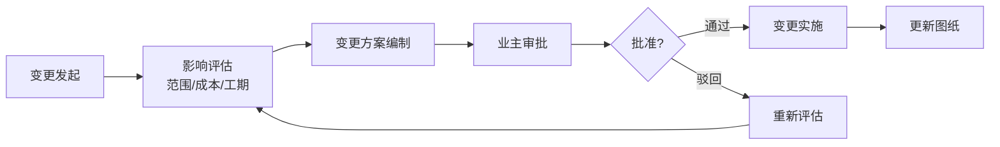

---

## 7. 设备选型流程

设备选型流程从技术需求整理到综合评估定标，为采购提供依据。

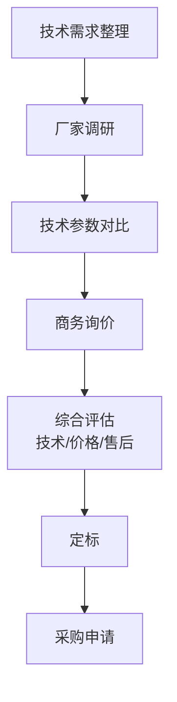

---

## 8. 招标流程

招标流程从编制招标文件到合同签订，覆盖完整招标周期。

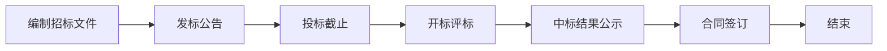

---

## 9. 施工进场流程

施工进场流程从进场准备到自检报验，完成系统安装的基础阶段。

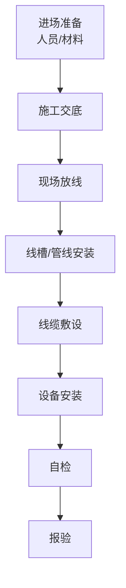

---

## 10. 隐蔽工程验收流程

隐蔽工程验收流程通过拍照记录和签字确认确保隐蔽工程质量可追溯。

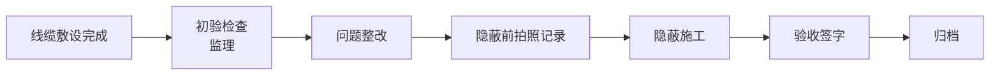

---

## 11. 系统调试流程

系统调试流程从单体设备调试到业主见证测试，确保系统功能完整可用。

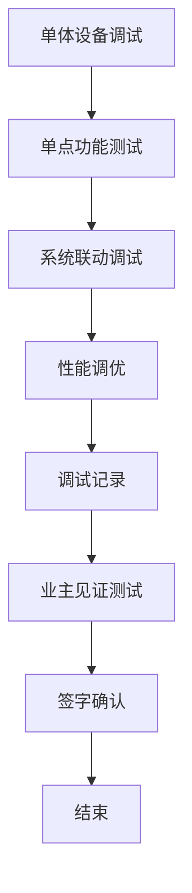

---

## 12. 竣工验收流程

竣工验收流程包含初验、整改消缺、终验三阶段，确保项目完整交付。

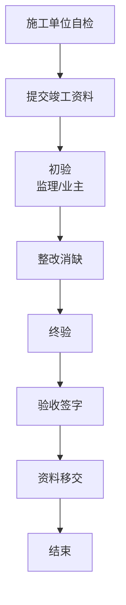

---

## 13. 故障处理流程

故障处理流程按故障等级（一般/严重/紧急）响应计时，闭环处理并归档记录。

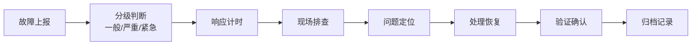

---

## 14. 运维巡检流程

运维巡检流程从制定计划到归档报告，实现周期性运维的标准化管理。

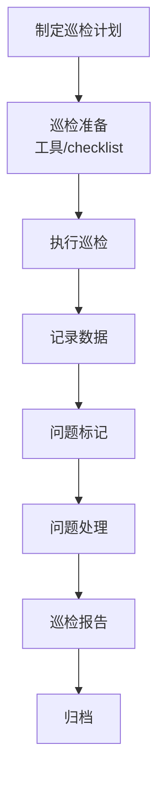