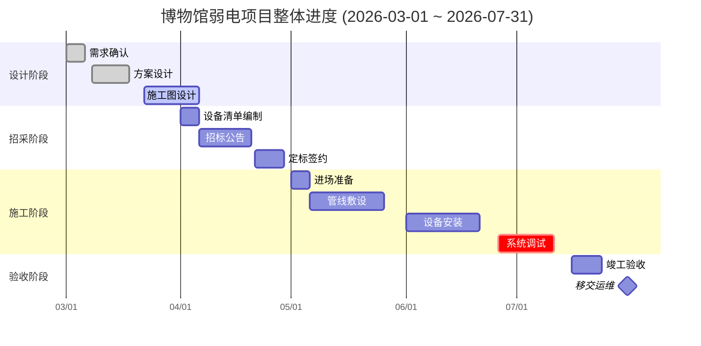
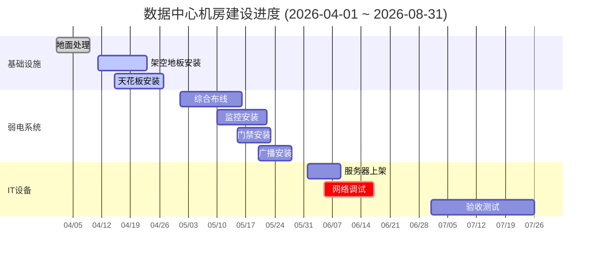
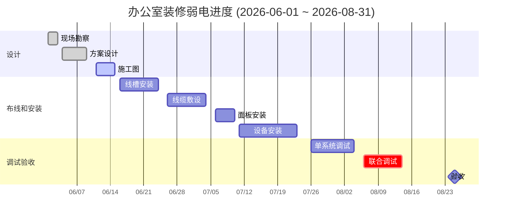
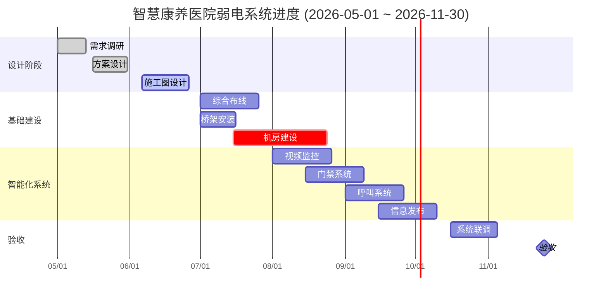
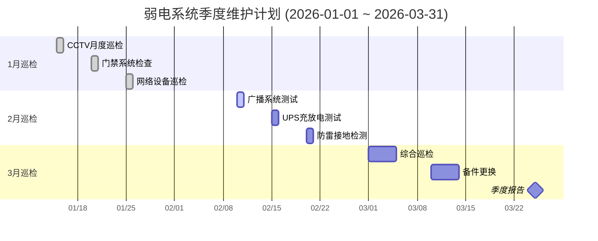
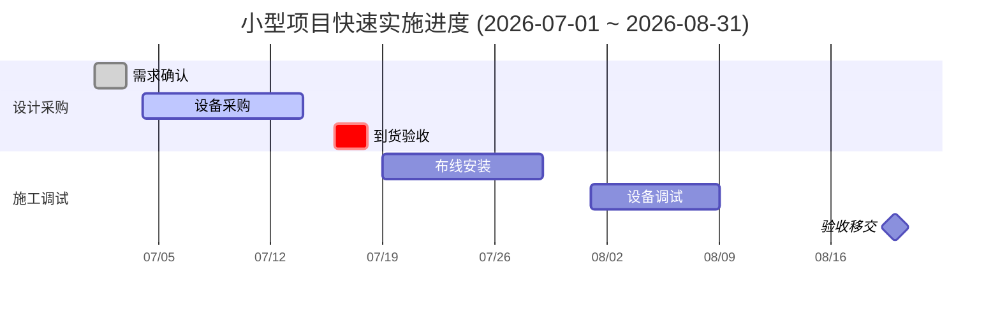

# ELV 弱电项目甘特图示例

本文件收录常见弱电（ELV）项目管理场景的 Mermaid Gantt 图模板，供方案编制和进度展示使用。

---

## 1. 博物馆弱电项目整体进度

适用于中大型文旅/博物馆弱电系统建设，覆盖设计、招采、施工、验收全流程。

---

## 2. 数据中心机房建设进度

适用于机房/数据中心弱电系统建设，突出基础设施、弱电系统、IT 设备三大板块并行推进。

---

## 3. 办公室装修弱电进度

适用于办公室装修场景下的弱电系统快速实施，强调设计→布线安装→调试验收三阶段衔接。

---

## 4. 智慧康养医院弱电系统进度

适用于大型医院/康养机构弱电系统建设，周期长、系统多，包含综合布线、监控、门禁、呼叫、信息发布等多个子系统。

---

## 5. 弱电系统季度维护计划

适用于既有项目的季度维护/巡检管理，按月划分任务，便于运维团队执行跟踪。

---

## 6. 小型项目快速实施进度

适用于小型弱电项目（2个月内快速交付），结构简洁，适合快速复制到提案或投标文件中。

---

> 使用说明：复制代码块内容到 Obsidian 或支持 Mermaid 的编辑器中即可渲染。`crit` 标记的任务为关键路径，`milestone` 为里程碑节点，`done`/`active` 表示完成状态，供进度汇报时区分已完成和进行中任务。