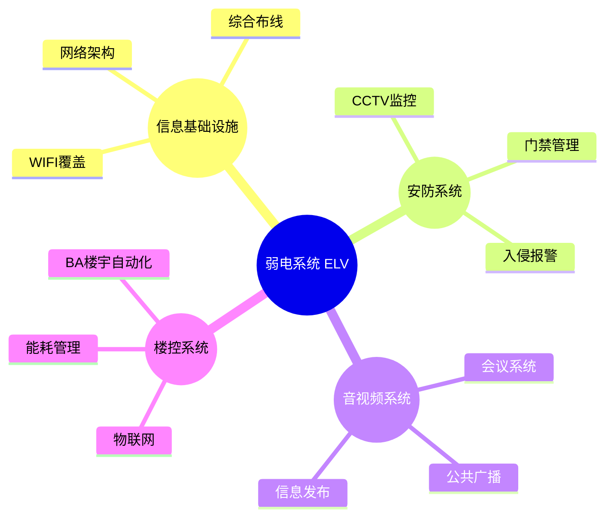
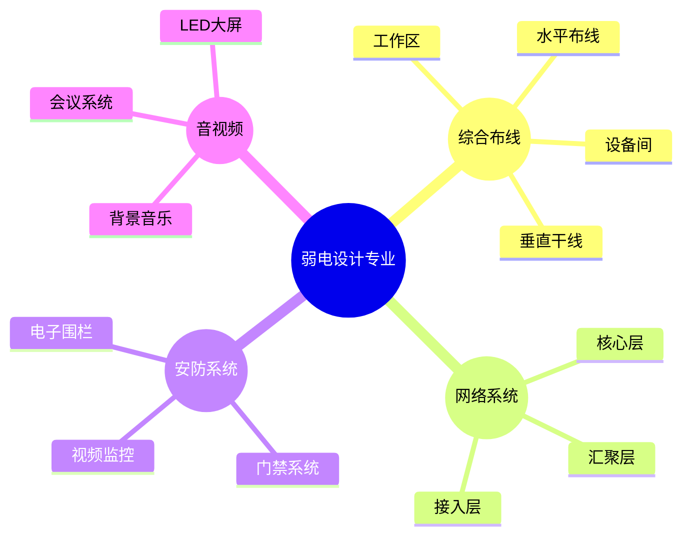
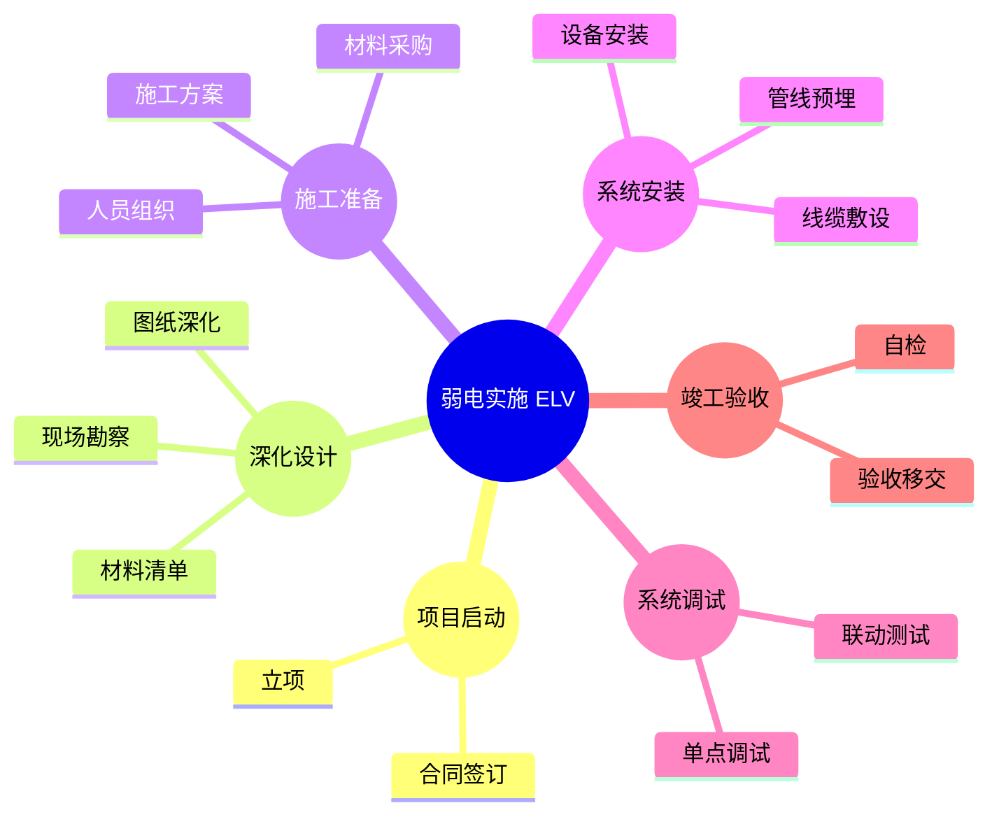
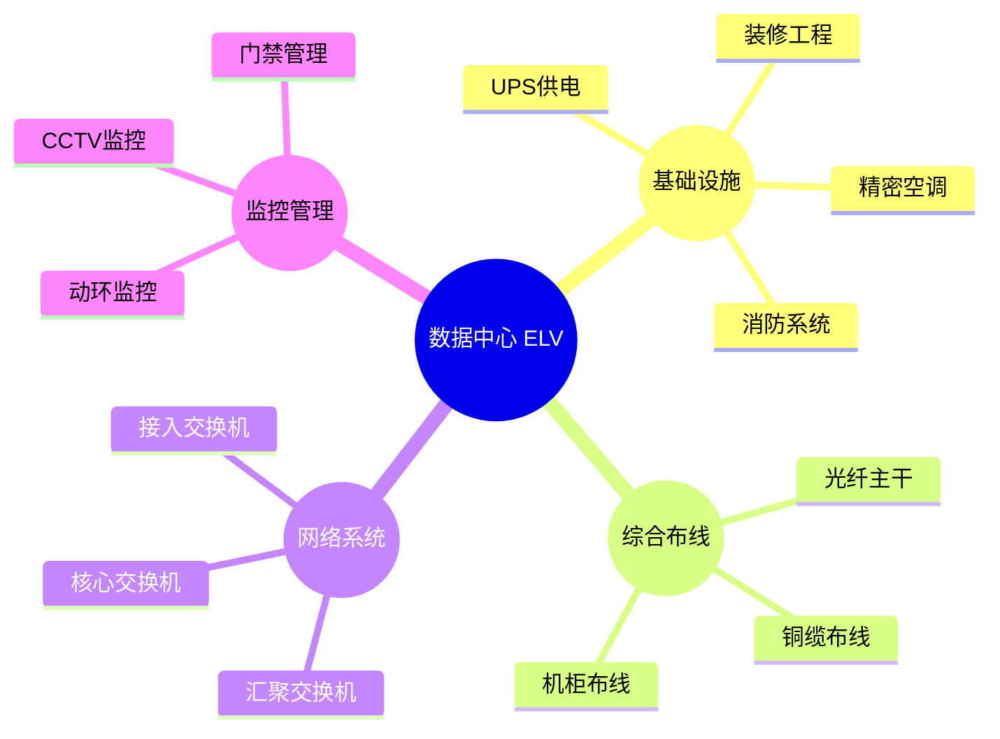
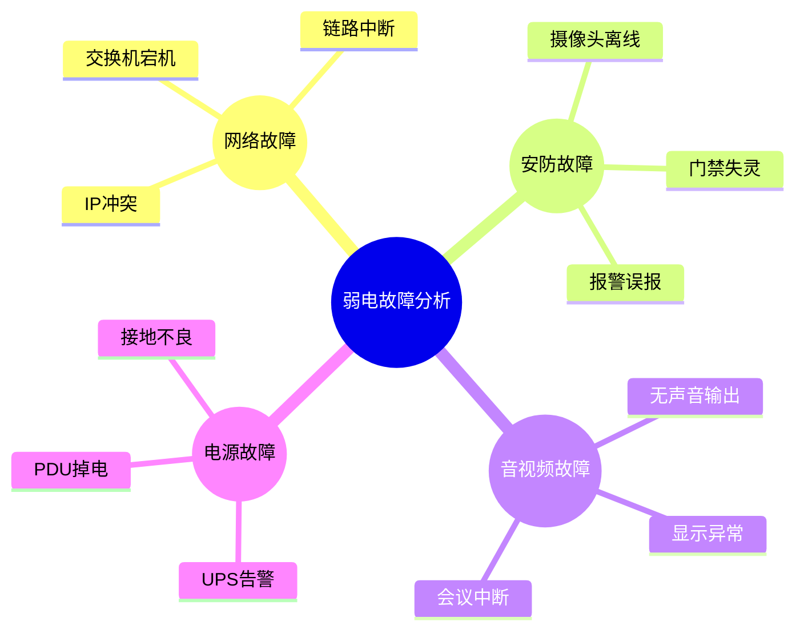
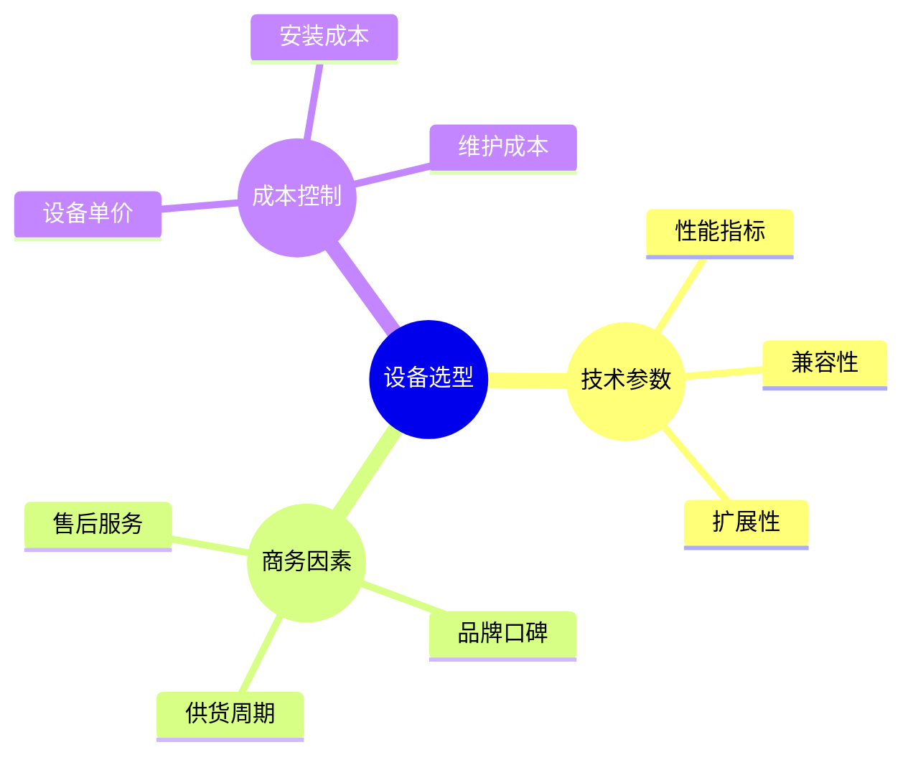

# 弱电 ELV 系统架构 Mindmap 示例

本文档提供 6 个 Mermaid mindmap 示例，涵盖弱电系统的架构设计、专业覆盖、项目流程、数据中心、故障分析和设备选型。

---

## 1. 弱电四大系统架构

四大核心子系统：信息基础设施、安防系统、音视频系统、楼控系统。

---

## 2. 弱电设计各专业覆盖

设计阶段需覆盖的各专业子系统及其层级结构。

---

## 3. 弱电实施项目全流程

从项目启动到竣工验收的完整实施周期。

---

## 4. 数据中心机房弱电架构

数据中心场景下的弱电系统分层架构。

---

## 5. 弱电系统常见故障分类

按系统类型划分的常见故障树。

---

## 6. 弱电设备选型考量因素

设备采购决策的多维度评估框架。

