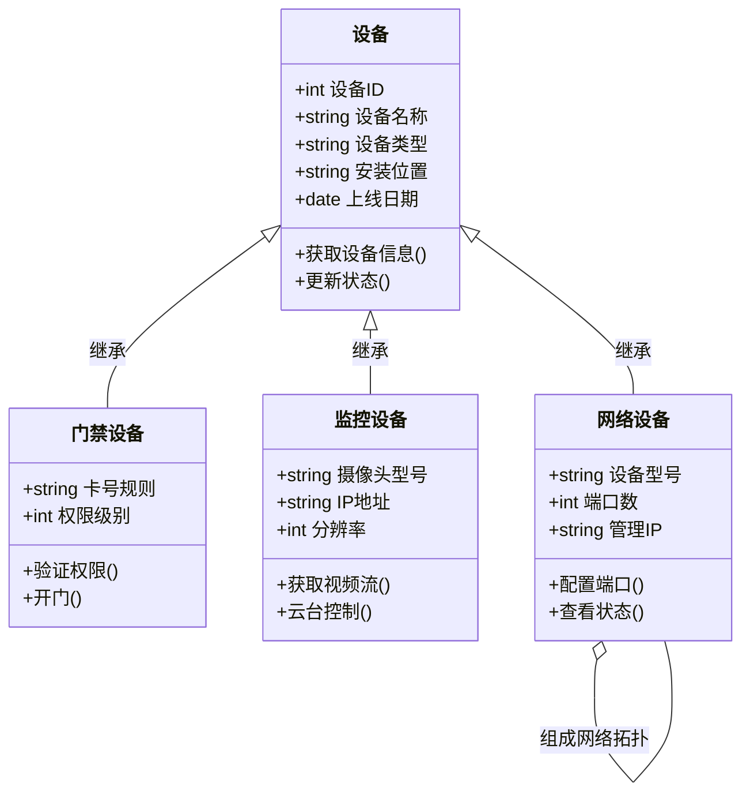
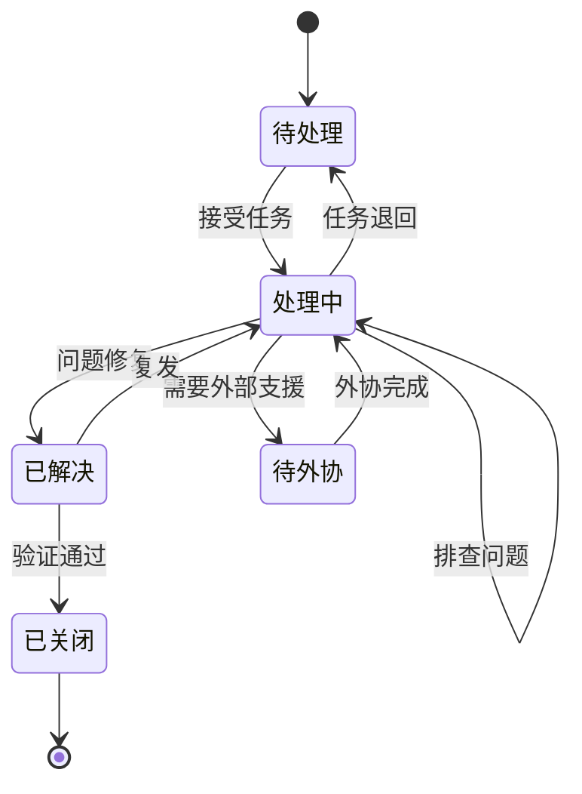
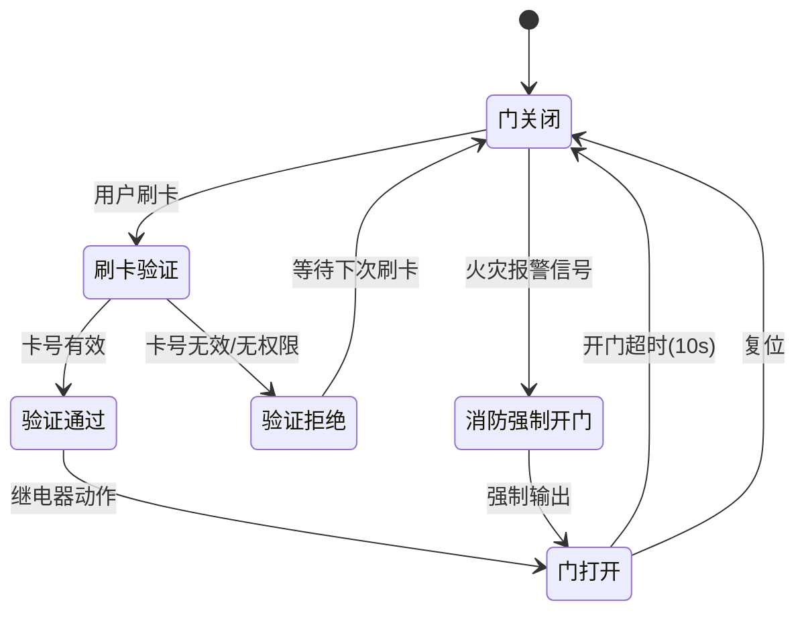
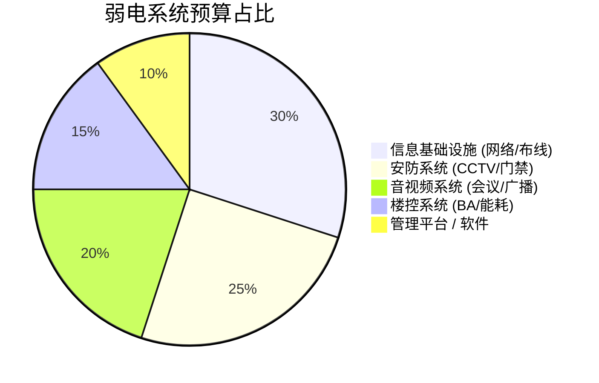
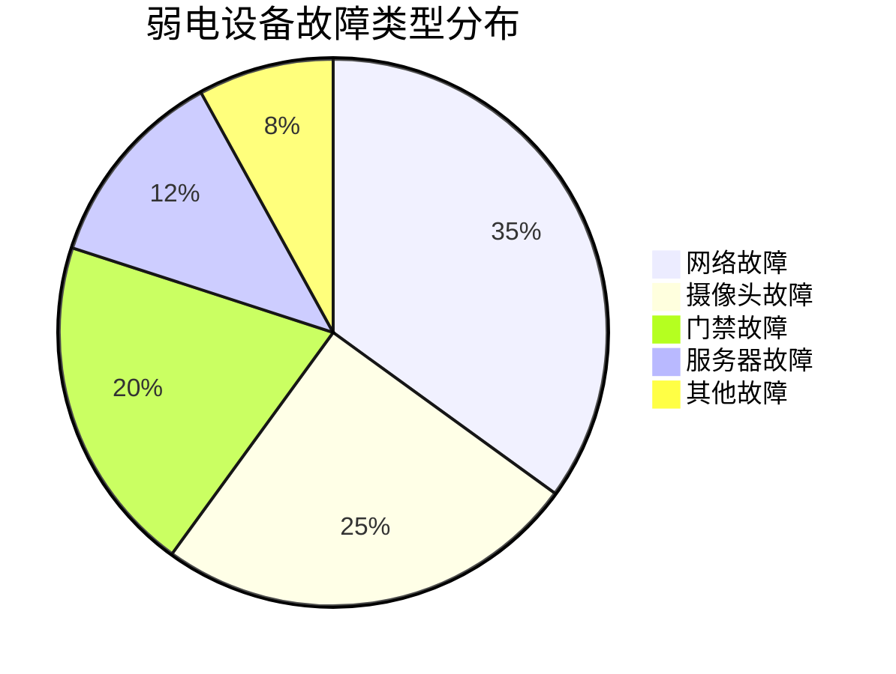
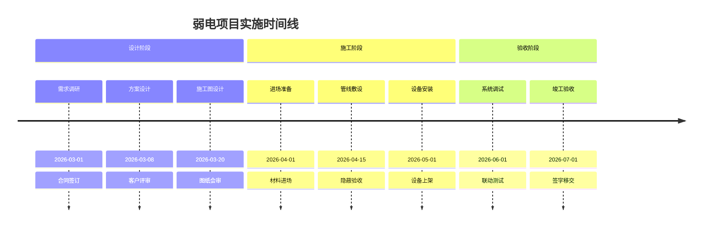
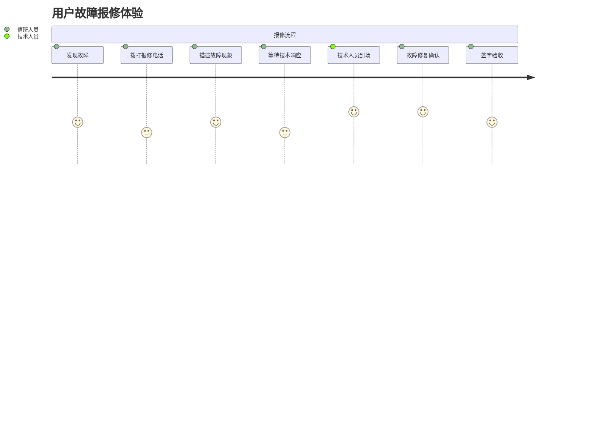

# 其他图表示例 (Other Diagram Examples)

本文档包含弱电（ELV）系统的类图、ER 图、状态图、饼图、时间线和用户旅程图示例。

---

## 类图 (Class Diagram) - 弱电设备管理

类图展示弱电系统中各类设备的继承关系，包括门禁、监控、网络设备的共有属性和各自特有的行为。

---

## ER 图 (ER Diagram) - 项目管理

ER 图展示弱电项目管理系统中的核心实体及其关联关系，包括项目、合同、设备清单和施工人员。

```mermaid
erDiagram
    accTitle: 项目管理 ER 图
    accDescr: 展示项目、合同、设备清单和施工人员之间的关联关系
    
    项目 {
        int id PK
        string 项目名称
        string 项目类型
        date 开始日期
        date 结束日期
        string 状态
    }
    合同 {
        int id PK
        int 项目ID FK
        string 合同编号
        decimal 合同金额
        date 签订日期
    }
    设备清单 {
        int id PK
        int 项目ID FK
        string 设备名称
        string 规格型号
        int 数量
    }
    施工人员 {
        int id PK
        string 姓名
        string 工种
        string 联系电话
    }
    
    项目 ||--o{ 合同 : 签订
    项目 ||--o{ 设备清单 : 包含
    项目 ||--o{ 施工人员 : 分配
```

---

## 状态图 (State Diagram) - 故障处理状态机

状态图描述弱电设备故障从发现到解决的完整生命周期，包含待外协处理和任务退回等分支场景。

---

## 状态图 - 门禁开关状态

状态图描述门禁系统的刷卡验证流程及消防强开场景。

---

## 饼图 (Pie Chart) - 弱电系统预算占比

饼图展示弱电项目中各子系统在总预算中所占的比例。

---

## 饼图 - 设备故障类型分布

饼图展示弱电设备各类故障的发生频率分布。

---

## 时间线 (Timeline) - 项目阶段

时间线展示弱电项目从设计到验收的完整实施计划。

---

## 用户旅程 (Journey) - 弱电故障报修

用户旅程图展示值班人员从发现故障到签字验收的完整报修体验流程。

