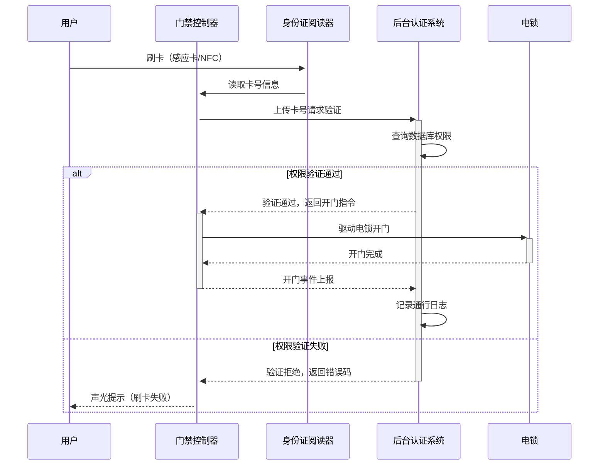
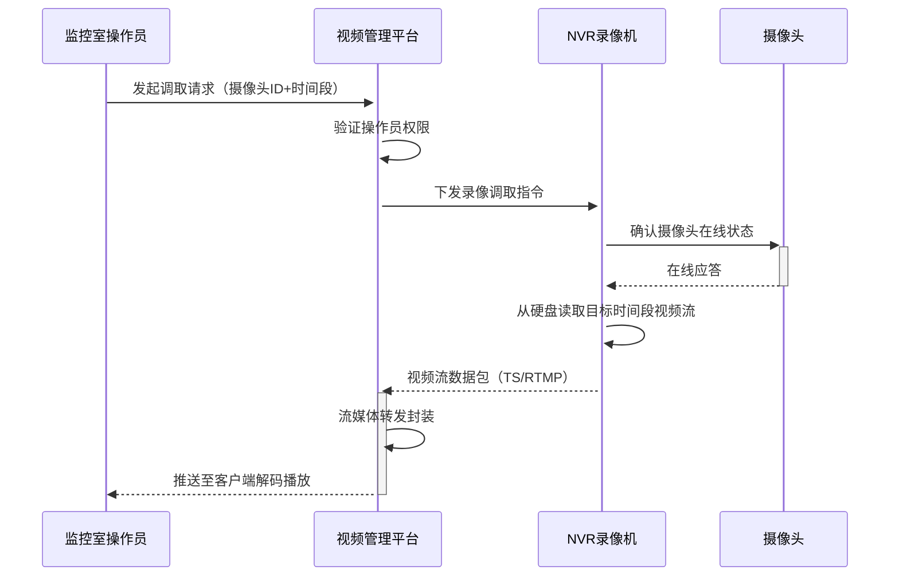
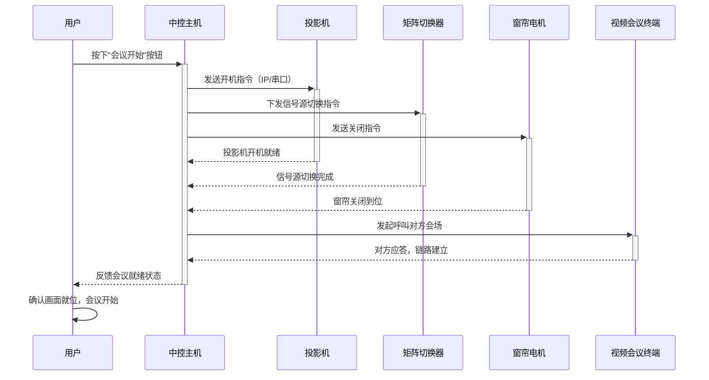
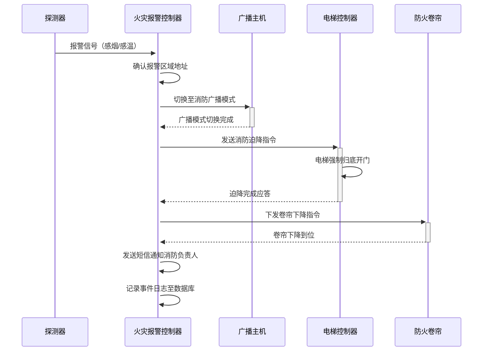
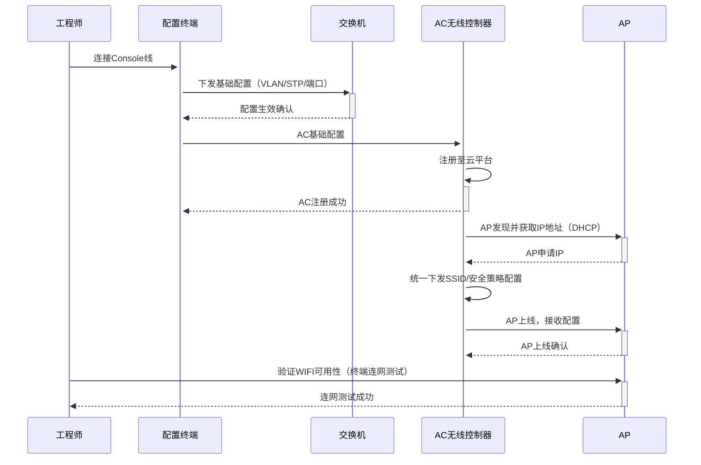
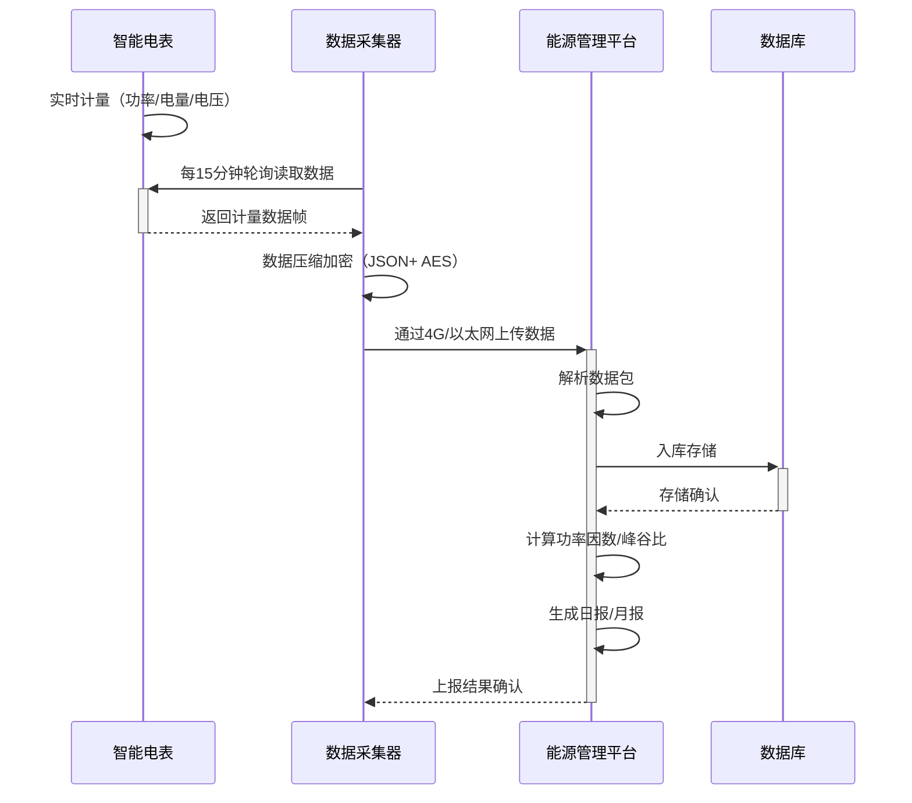
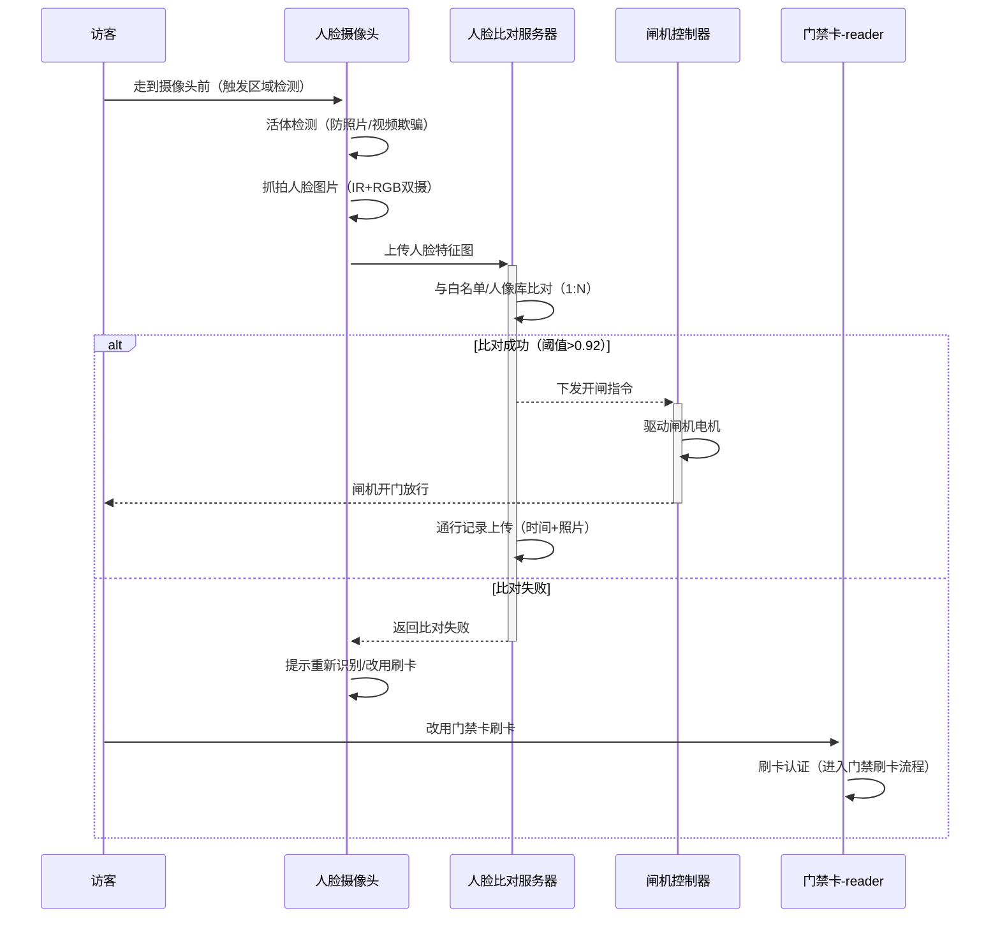

# ELV System Sequence Diagrams / 弱电系统时序图集

---

## 1. 用户进门刷门禁时序

用户刷卡进门时，门禁系统完成身份认证、权限校验、电锁控制的全流程时序。



---

## 2. 监控视频调取时序

监控室操作员调取历史录像时，视频管理平台、NVR、摄像头之间协作完成视频回放的全流程。



---

## 3. 公共广播喊话时序

值班员通过广播控制主机完成实时喊话的全流程，包含音频采集、功放放大和分区输出。

```mermaid
sequenceDiagram
    accTitle: 公共广播喊话时序
    accDescr: 值班员按下喊话键后，系统依次完成模式切换、音频采集、功放放大和分区输出

    participant 值班员
    participant 广播控制主机
    participant 功放
    participant 扬声器网络

    值班员->>+广播控制主机: 按下喊话键
    广播控制主机->>广播控制主机: 进入喊话模式，关闭背景音乐
    广播控制主机->>+功放: 实时音频流（MIC采集）
    功放->>功放: 信号放大处理
    广播控制主机->>广播控制主机: 读取分区配置（按区域选择）
    功放->>+扬声器网络: 分区音频输出
    扬声器网络-->>-功放: 输出确认
    值班员->>-广播控制主机: 喊话结束，释放按键
    广播控制主机->>广播控制主机: 恢复背景广播模式
```

---

## 4. 会议系统一键启动时序

用户按下"会议开始"后，中控主机依次协调投影机、矩阵、窗帘、会议终端完成会议准备。



---

## 5. 火灾报警联动时序

探测器报警后，火灾报警控制器触发消防广播、电梯迫降、防火卷帘下降和短信通知的全联动时序。



---

## 6. 网络设备开局时序

工程师完成交换机、AC、AP开局配置的完整时序，涉及Console配置、云平台注册和SSID统一下发。



---

## 7. 能耗数据采集时序

智能电表实时计量数据经采集器压缩加密后上传至能源管理平台，平台计算峰谷比并生成报表。



---

## 8. 人脸识别速通门时序

访客到达速通门后，系统完成活体检测、人脸比对、下发开闸指令的完整通行时序。



---

*编制人：DUDU&Cailleach*